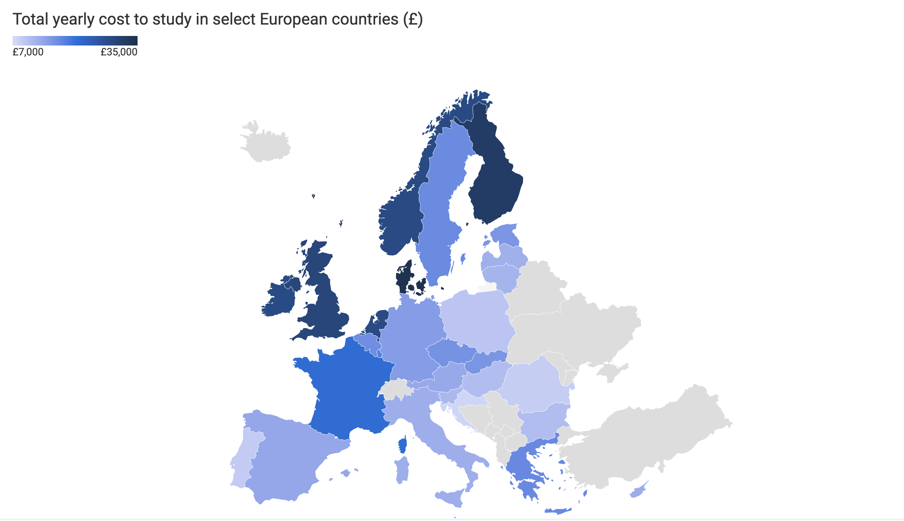
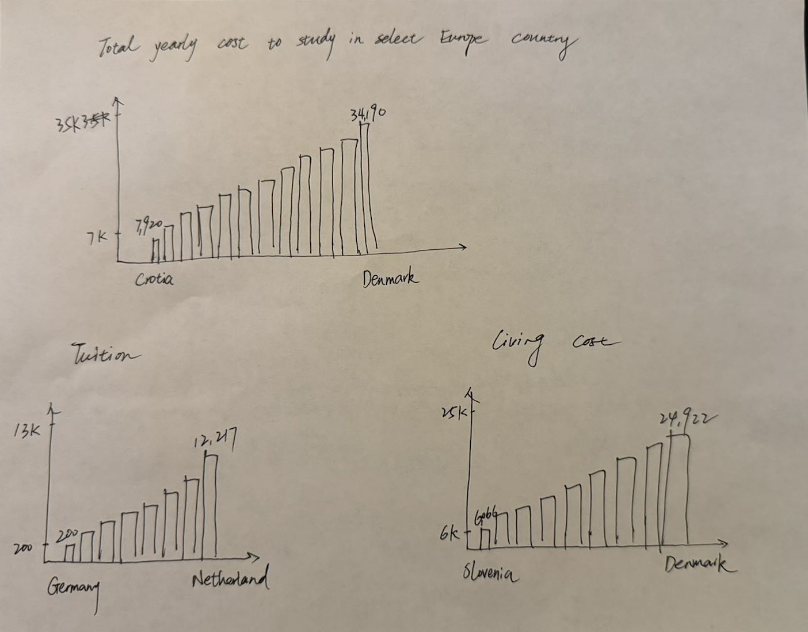

| [home page](https://cmustudent.github.io/tswd-portfolio-templates/) | [Visualizing government Debt](visualizing-government-debt) | [critique by design](critique-by-design) | [final project I](final-project-part-one) | [final project II](final-project-part-two) | [final project III](final-project-part-three) |

## Step one: the visualization

Screenshot from: https://www.finder.com/uk/current-accounts/student-bank-accounts/cheapest-countries-to-study-europe

_The reason why I choose this visualization is that I am an iternational student, so I am curious about what would be the expense on other country if I study there. And when I click into the link, the visualization map presents some simple data which I think is useful for those who want to general idea of the cost studying in Europe._

## Step two: the critique
_At the first glance, the visualization does provide a good impression to me. It utilizes light and dark color of blue to represent how much would be the cost if student study there. However, if I want to get more detail information, like living cost or tuition, I would need to read through the table in the webpage. Plus, if the reader is not familiar with the geography of Europe, the map visualization would not be helpful, so I decide to redesign this visualization with barchart, which provide more statistic for the audiences._

## Step three: Sketch a solution

_This is the sketch that I have. I sketched three bar charts. The upper one is the total cost, the lest bottom one is the tuition cost, and the right bottom one is the living cost. In the bar chart, the Y-axis represents how much is the cost, and the X-axis is listing the different countries. I also label the number at the top of each bar, which could provide direct data to the audiences._

## Step four: Test the solution

Questions to ask: 

- Can you tell me what you think this is and describe it?

- Who do you think is the intended audience for this?

- Is there anything you would change or do differently?

Results: 

_Student, mid 20's._
This visualization is quite obvious. It tells me about the different cost between different countries in Europe. It is surprised that the cost of study in Denmark is the most expensive, probably because of the living cost. I think the intended audience would be some international students like me. I did quite a lot of research on the tuition and fee when I decide to study abroad. Personally, I would like to add color on the graph to distinguish between different country.

_Student, mid 20's._
This is a bar chart about tuition fee and living cost around Europe. This visualization tells me which country’s cost is the highest and the lowest. I think the audience who be those students who want to study Europe and try to find some general information about it. If I do this visualization, I would probably switch the column of the country and the cost, so then it would be more clearly for the audience to read. Furthermore, I will just use one bar chart instead, and leave the living cost and tuition in annotation.

Synthesis: 

_After the interview, I modify my sketch in the tableau based on their advice, but I found out that using too many colors for different countries would only make the visualization look chaos. However, after I switch the columns and rows variable, with cost in columns and coutry in rows, it does increase the readability of the graph._

## Step five: build the solution

_Include and describe your final solution here. It's also a good idea to summarize your thoughts on the process overall. When you're done with the assignment, this page should all the items mentioned in the assignment page on Canvas(a link or screenshot of the original data visualization, documentation explaining your process, a summary of your wireframes and user feedback, your final, redesigned data visualization, etc.)._

    <noscript>
        
    </noscript>
    <object class='tableauViz' style='display:none;'>
        <param name='host_url' value='https%3A%2F%2Fpublic.tableau.com%' />
        <param name='embed_code_version' value='3' />
        <param name='site_root' value='' />
        <param name='name' value='visualization2_17266187722420/Sheet1' />
        <param name='tabs' value='no' />
        <param name='toolbar' value='yes' />
        <param name='static_image' value='https://public.tableau.com/static/images/vi/visualization2_17266187722420/Sheet1/1.png' />
        <param name='animate_transition' value='yes' />
        <param name='display_static_image' value='yes' />
        <param name='display_spinner' value='yes' />
        <param name='display_overlay' value='yes' />
        <param name='display_count' value='yes' />
        <param name='language' value='en-US' />
        <param name='filter' value='publish=yes' />
    </object>

