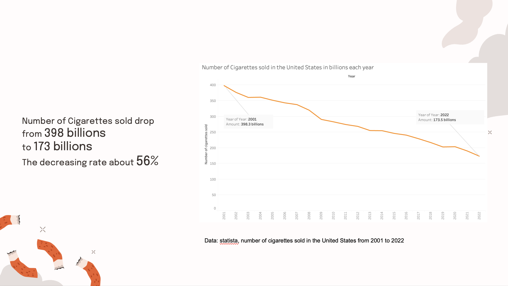
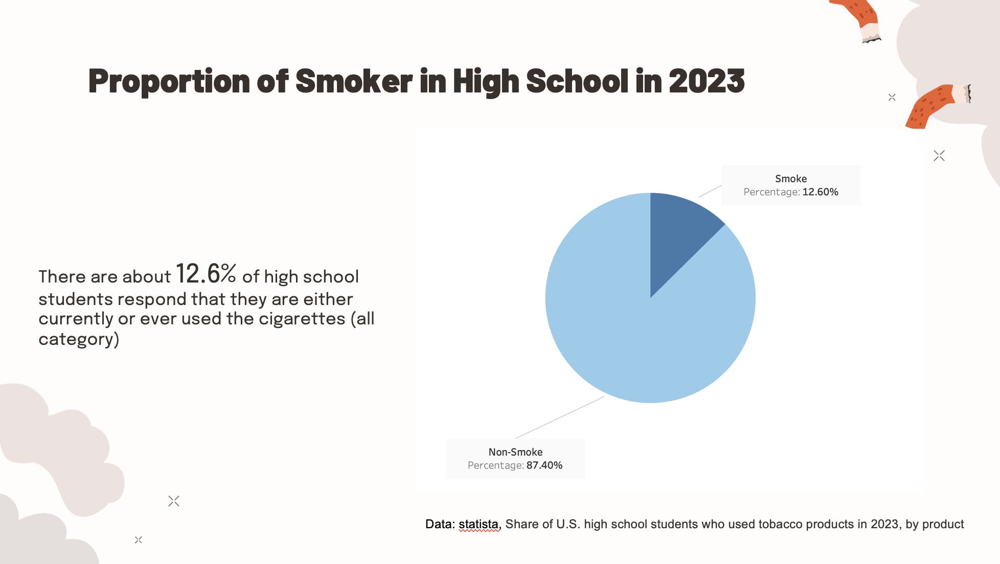
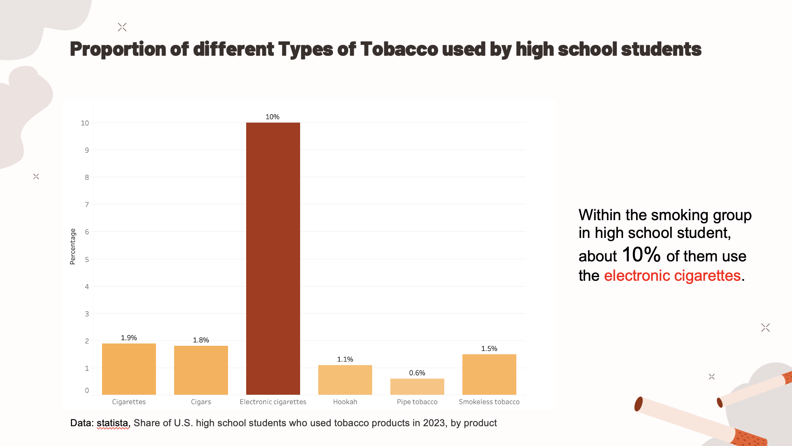
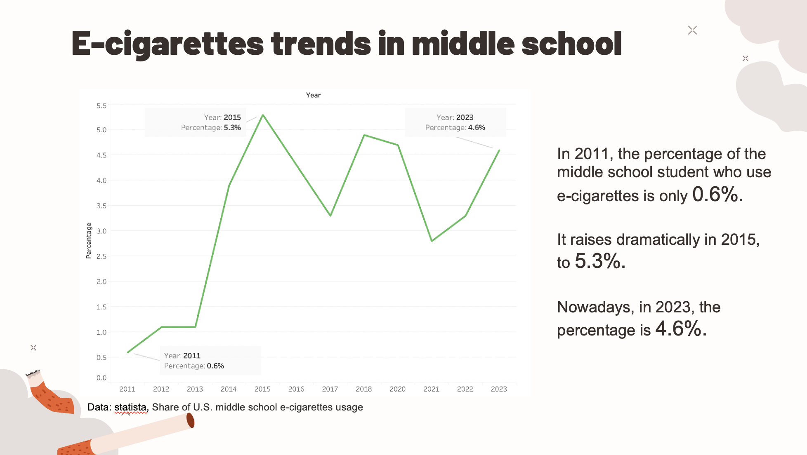
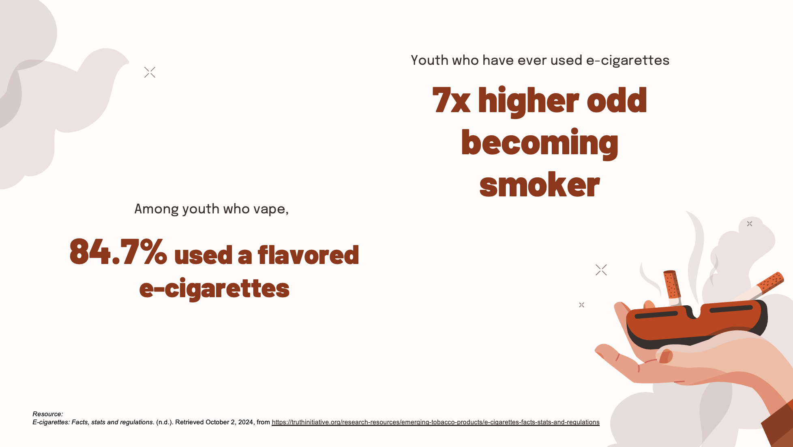
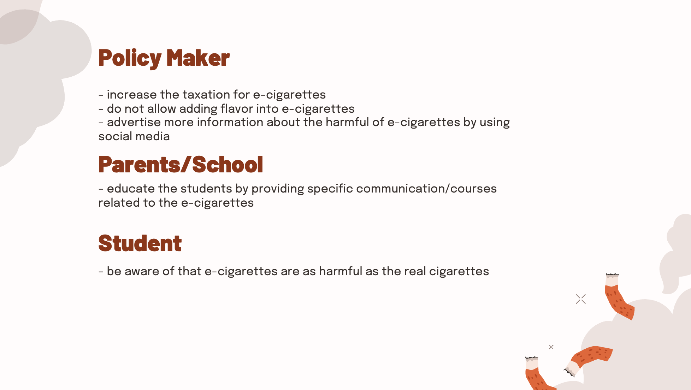

| [home page](https://hoklam6.github.io/portfolio/) | [visualizing debt](visualizing-government-debt) | [critique by design](critique-by-design) | [final project I](final-project-part-one) | [final project II](final-project-part-two) | [final project III](final-project-part-three) |

# Wireframes / storyboards
Personally, I am a smoker. When I think about what is the very first type of cigarette I smoke, the e-cigarettes comes to my mind. It tastes like candy and looks cool when you smoke with my friends. After that, I start to have the curiosity to try the cigarettes, and eventually get addictive to nicotine. In the project part I, I provide a very broad topics in the smoking, telling some very general points that people might already know, so I decide to narrow down my topic. As my experience, vaping is the start point of becoming a smoker. How about other people? With this question in my mind, I start to research on the related data. Below is the dataset that I used:

| Name | URL | Description |
|------|-----|-------------|
|Cigarettes Sold|[link](https://docs.google.com/spreadsheets/d/1s42eRRonjpBBN7XlQJhDxg5LJsjoObGb/edit?usp=drive_link&ouid=112753444815487657032&rtpof=true&sd=true)|Statistics about cigarettes sold in United States from 2001 to 2022|
|Middle School e-cigarettes usage|[link](https://docs.google.com/spreadsheets/d/1uZGOV5UM3qSqnsVY5G57aJE2Lw-pthvi/edit?usp=drive_link&ouid=112753444815487657032&rtpof=true&sd=true)|This dataset includes the percentage of e-cigarettes smoker in middle school from 2011 to 2023|
|Share of tobacco products used |[link](https://docs.google.com/spreadsheets/d/1CGTRORwrFBm6frXv7KhqkxT3mNB6Ecyf/edit?usp=drive_link&ouid=112753444815487657032&rtpof=true&sd=true)|It includes the percentage of different type of tobacco used by high school students|
|Smoke User Repond|[link](https://docs.google.com/spreadsheets/d/1jc_aXD96xCW-713x9ENtyrriXXkILRuz/edit?usp=drive_link&ouid=112753444815487657032&rtpof=true&sd=true)|It is the data about the survey of how the smoker think of the harm of smoking different type of tobacco products|

At the very start of my story, I provide the general trends of smoking in the United States. It shows that the consumption of normal cigarettes is actually decrease drmatically within these 10 years.

In the second visualization, I narrows the story to the youth level, presenting the proportion of smoker within students.

After that, I separate the whole smoking group of youth into different group by the category of the tobacco products, and found that the e-cigarettes is the most prevalent.

How is the e-cigarettes trends within this year? When it starts to become popular? With these two questions, I found the data related to the usage of e-cigarettes within middle school student.

I utilize the data from the survey to create this visualization, showing that people generally have the thought that e-cigarettes is not as harmful as the normal cigarettes.

I also found some numerical statistics to supoort my idea -- Youth like the taste of the e-cigarettes.

Here is the Call to Action part.

# User research 

## Target audience
My audience for this particular presentation can be categorized into three distinct groups: Youth, Parent/School, and Policymakers

Youth
One of the key focuses of this visualization project is to keep the youth away from the tobacco. By educating them these visualizations, they should be aware of the reason what lead them to the addiction of real cigarettes. For those who currently use or ever used e-cigarettes, they are the group which is more likely to become a cigarettes smoker.

Parent/School
Parent and school should be aware of the health and financial risks associated with smoking. I hope to make them more conscious of their children's health. Parents can have more communications with their children about e-cigarettes, while school could hold some courses to teach the student about the harm of nicotine with the detail examples.

Policymakers
Ultimately, to realize the health of new generation, I should persuade lawmakers to address the e-cigarettes problem. A suggestion of mine is to legislate the law about banning the flavor in the e-cigarettes. By doing so, when the youth want to try the e-cigarettes, they would not think that it is some kind of candy, but rather they would be aware that this is the actual kind of tobacco. 

## Interview script
I wanted to choose three people that represented a wide demographic of people I want to interview: current smoker, non-smoker and children's parent. I found friends/family that fit three archetypes: One of my friends who has smoked more than 5 years, One who has the experience of e-cigarettes but currently does not smoke any kind of tobacco, and a father of the children. I believed using these three interviewees as representatives for my target audience could influence feedback in those 3 key areas.

| Goal | Questions to Ask |
|------|------------------|
|Make the graphs being used to investigate the trends of e-cigarettes in recent years within youth|What message do you think these graphs convey? Do you think that there is any improvement for this graph?|
|Is my presentation effective when motivating the audience to act on smoking problem?| What do you like/don’t like about the suggestions?|
|Is the story structure effective in promoting anti e-cigarettes law?|Is there anything the presentation could emphasize more?|

## Interview findings
<table>
  <thead>
    <tr>
      <th>Questions</th>
      <th>Interview 1 (University Student, Current Smoker)</th>
      <th>Interview 2 (University Student, Non-Smoker)</th>
      <th>Interview 3 (Parents of Middle School Child)</th>
    </tr>
  </thead>
  <tbody>
    <tr>
      <td><strong>What message do you think these visualizations convey?</strong></td>
      <td>The graphs illustrate a trend of vaping among teenagers, particularly in middle school and high school. They convey the message that vaping is becoming a significant issue, while traditional cigarette usage may be decreasing.</td>
      <td>The graphs highlight the prevalence of e-cigarette use among youth. The visualizations convey a clear message about the increasing popularity of vaping, which seems to be a safer alternative to smoking traditional cigarettes, though this point of view is wrong.</td>
      <td>The graphs clearly highlight a rising trend of e-cigarette use among youth, particularly those in middle school. These graphs indicate that vaping is becoming an increasing behavior in younger age groups, which is concerning for parents.</td>
    </tr>
    <tr>
      <td><strong>Do you think that there is any improvement for this graph?</strong></td>
      <td>Yes, there are a few improvements that could be made. Adding more detail and clarity of the data could help. Additionally, putting some more context around the health implications of vaping compared to smoking could strengthen the message. Comparing the data from earlier years could also illustrate trends over time more effectively.</td>
      <td>Yes, the graphs could be improved by making sure that the data points are clear, and ensuring that the graphs use consistent labeling to avoid confusion. Interactive elements such as tooltips could make the data more engaging if presented online.</td>
      <td>I think the graphs are great in general.</td>
    </tr>
    <tr>
      <td><strong>What do you like or don’t like about the suggestions?</strong></td>
      <td>I pretty like the straightforward and actionable suggestions like increasing taxation and banning flavored e-cigarettes. These seem like practical steps to decrease the use of e-cigarettes among teens. However, more innovative solutions could be explored, such as peer influence strategies to be more appealing to the youth.</td>
      <td>I like your visualization. It gradually zooms in to the topic you want to discuss, but I think more detail should be added to the call to action, making it more specific and clear.</td>
      <td>I like your proposal on e-cigarettes, and I want to know more about how parents can take a proactive step when communicating with children.</td>
    </tr>
    <tr>
      <td><strong>Is there anything the presentation could emphasize more?</strong></td>
      <td>It would be helpful if the presentation emphasized more on the addictive point of nicotine, regardless of its form. Highlighting the transition risk from vaping to traditional smoking could also be impactful, especially for an audience that might view vaping as a harmless cigarettes.</td>
      <td>The presentation could emphasize more on the direct health effects of vaping, using data and possibly real-life examples or case studies.</td>
      <td>It would be beneficial if the presentation included more information about the psychological and social factors that influence teens to start vaping. Understanding these factors can help parents and school to develop more effective communication strategies to prevent e-cigarette use by teenagers. </td>
    </tr>
  </tbody>
</table>

# Identified changes for Part III

| Research synthesis                       | Anticipated changes for Part III                                                |
|------------------------------------------|---------------------------------------------------------------------------------|
| Detail the call to action | Based on the interview, most of them mention that I should put more stuffs in the Call to Action session |
|  Add more context to make the whole visualization more interested | Currently, I did not provide any context except the description of the visualization|

