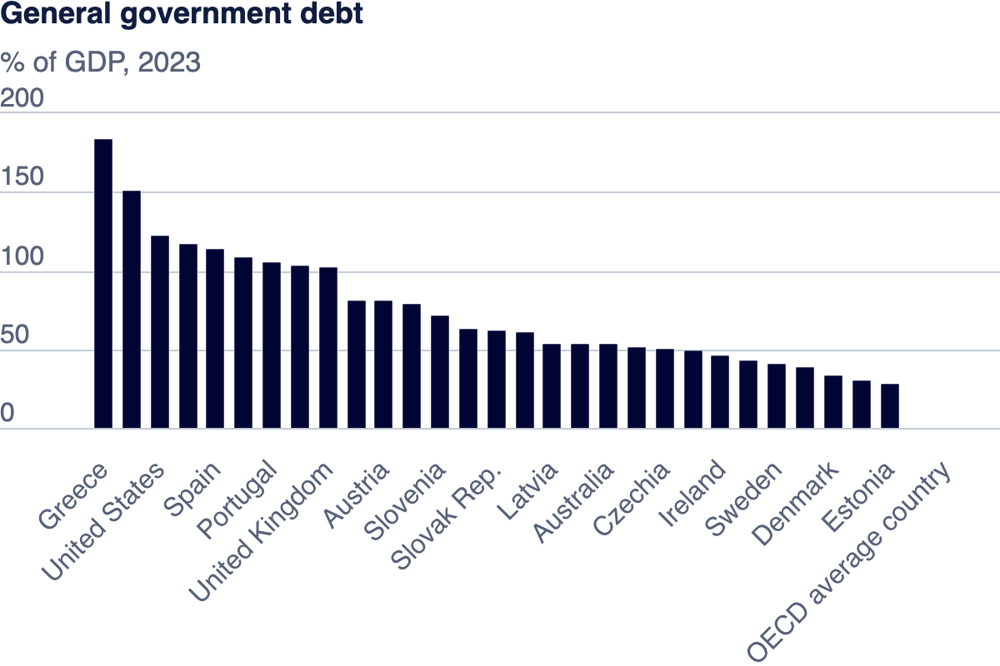

| [home page](https://hoklam6.github.io/portfolio/) | [visualizing debt](visualizing-government-debt) | [critique by design](critique-by-design) | [final project I](final-project-part-one) | [final project II](final-project-part-two) | [final project III](final-project-part-three) |

# Assignment: Visualizing government debt using Tableau

## Part one: Working with web-based visualization tools and data

_Include your visualization, and introduce us to what you did._

## Part two: Working with Tableau
[Link to the graph](https://public.tableau.com/views/Book1_17256507270470/GeneralDebt?:language=en-US&:sid=&:redirect=auth&:display_count=n&:origin=viz_share_link)

    <noscript>
        
    </noscript>
    <object class='tableauViz' style='display:none;'>
        <param name='host_url' value='https%3A%2F%2Fpublic.tableau.com%2F' />
        <param name='embed_code_version' value='3' />
        <param name='site_root' value='' />
        <param name='name' value='Book1_17256507270470/GeneralDebt' />
        <param name='tabs' value='no' />
        <param name='toolbar' value='yes' />
        <param name='static_image' value='https://public.tableau.com/static/images/Bo/Book1_17256507270470/GeneralDebt/1.png' />
        <param name='animate_transition' value='yes' />
        <param name='display_static_image' value='yes' />
        <param name='display_spinner' value='yes' />
        <param name='display_overlay' value='yes' />
        <param name='display_count' value='yes' />
        <param name='language' value='en-US' />
        <param name='filter' value='publish=yes' />
    </object>

## Part three: create your own visualization

_I choose to create a world heat map to indicate which country has the highest avarage ratio, and I label those countries that people are most familiar with. I utilize the red color to present the information, which works fine. This is a follow graph of part 2. Reader can easily find out the key information from the map. The map is clear and without too many data labeled. It is helpful for those audiences who are not good at geography._

[Link to the graph](https://public.tableau.com/shared/R5WHSKJMB?:display_count=n&:origin=viz_share_link)

    <noscript>
        
    </noscript>
    <object class='tableauViz' style='display:none;'>
        <param name='host_url' value='https%3A%2F%2Fpublic.tableau.com%2F' />
        <param name='embed_code_version' value='3' />
        <param name='site_root' value='' />
        <param name='name' value='Book2_17256587285940/Individualgraph' />
        <param name='tabs' value='no' />
        <param name='toolbar' value='yes' />
        <param name='static_image' 
               value='https://public.tableau.com/static/images/Bo/Book2_17256587285940/Individualgraph/1.png' />
        <param name='animate_transition' value='yes' />
        <param name='display_static_image' value='yes' />
        <param name='display_spinner' value='yes' />
        <param name='display_overlay' value='yes' />
        <param name='display_count' value='yes' />
        <param name='language' value='en-US' />
        <param name='filter' value='publish=yes' />
    </object>

